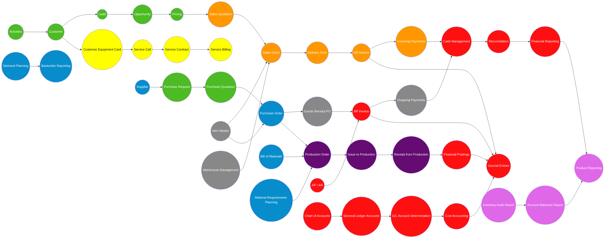

# SAP Business One — Diagrama de procesos

Diagrama reconstruido en Mermaid a partir de la imagen proporcionada.

```mermaid
flowchart LR
    Activities((Activities)) --> Customer((Customer))
    Customer --> Lead((Lead))
    Lead --> Opportunity((Opportunity))
    Opportunity --> Pricing((Pricing))
    Pricing --> SalesQuotation((Sales Quotation))
    SalesQuotation --> SalesOrder((Sales Order))
    SalesOrder --> DeliveryNote((Delivery Note))
    DeliveryNote --> ARInvoice((AR Invoice))
    ARInvoice --> IncomingPayments((Incoming Payments))

    Customer --> CustomerEquipmentCard((Customer Equipment Card))
    CustomerEquipmentCard --> ServiceCall((Service Call))
    ServiceCall --> ServiceContract((Service Contract))
    ServiceContract --> ServiceBilling((Service Billing))

    Supplier((Supplier)) --> PurchaseRequest((Purchase Request))
    PurchaseRequest --> PurchaseQuotation((Purchase Quotation))
    PurchaseQuotation --> PurchaseOrder((Purchase Order))
    PurchaseOrder --> GoodsReceiptPO((Goods Receipt PO))
    GoodsReceiptPO --> APInvoice((AP Invoice))
    APInvoice --> OutgoingPayments((Outgoing Payments))

    ItemMaster((Item Master)) --> SalesOrder
    ItemMaster --> PurchaseOrder
    WarehouseManagement((Warehouse Management)) --> SalesOrder
    PurchaseOrder --> ProductionOrder((Production Order))
    BillOfMaterials((Bill of Materials)) --> ProductionOrder
    MaterialRequirements((Material Requirements Planning)) --> ProductionOrder
    DemandPlanning((Demand Planning)) --> BackorderReporting((Backorder Reporting))
    ProductionOrder --> IssueToProduction((Issue to Production))
    IssueToProduction --> ReceiptFromProduction((Receipt from Production))

    APAR((AP / AR)) --> APInvoice
    IncomingPayments --> CashManagement((Cash Management))
    OutgoingPayments --> CashManagement
    CashManagement --> Reconciliation((Reconciliation))
    Reconciliation --> FinancialReporting((Financial Reporting))
    ChartOfAccounts((Chart of Accounts)) --> GeneralLedger((General Ledger Accounts))
    GeneralLedger --> GLAccountDetermination((G/L Account Determination))
    GLAccountDetermination --> CostAccounting((Cost Accounting))
    CostAccounting --> JournalEntries((Journal Entries))
    ARInvoice --> JournalEntries
    APInvoice --> JournalEntries
    ReceiptFromProduction --> FinancialPostings((Financial Postings))
    FinancialPostings --> JournalEntries

    InventoryAuditReport((Inventory Audit Report)) --> AccountBalancesReport((Account Balances Report))
    AccountBalancesReport --> ProductReporting((Product Reporting))
    FinancialReporting --> ProductReporting

    classDef crm fill:#4dbb24,color:#fff;
    classDef service fill:#ffff00,color:#111;
    classDef sales fill:#ff9800,color:#fff;
    classDef inventory fill:#888,color:#fff;
    classDef purchasing fill:#078dcc,color:#fff;
    classDef finance fill:#ff1010,color:#fff;
    classDef production fill:#640c72,color:#fff;
    classDef reporting fill:#df68e8,color:#fff;

    class Activities,Customer,Lead,Opportunity,Pricing,PurchaseRequest,PurchaseQuotation crm;
    class CustomerEquipmentCard,ServiceCall,ServiceContract,ServiceBilling service;
    class SalesQuotation,SalesOrder,DeliveryNote,ARInvoice,IncomingPayments sales;
    class ItemMaster,WarehouseManagement,GoodsReceiptPO,OutgoingPayments inventory;
    class Supplier,PurchaseOrder,MaterialRequirements,DemandPlanning,BackorderReporting,BillOfMaterials purchasing;
    class APAR,APInvoice,CashManagement,Reconciliation,FinancialReporting,ChartOfAccounts,GeneralLedger,GLAccountDetermination,CostAccounting,FinancialPostings,JournalEntries finance;
    class ProductionOrder,IssueToProduction,ReceiptFromProduction production;
    class InventoryAuditReport,AccountBalancesReport,ProductReporting reporting;
```
